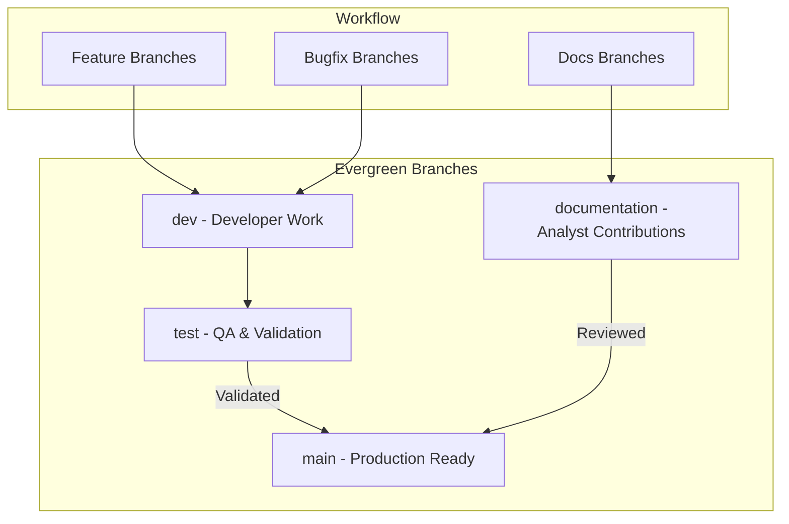

```markdown 

    This diagram represents the developer workflow and merge strategy
    for the School Management System Project. For each task that a developer 
    or analyst takes on, they should create a corresponding branch. 
    
    If it is a documentation task, the documentation branch should be 
    merged into the documentation evergreen branch when it is ready for review
    by the rest of the team.

    If it is a development task, then the development should happen on the
    individual branch until the capability is functional. Once functional, 
    it is ready to be merged to the dev branch. This branch is used to confirm 
    that the new code doesn't conflict with any other changes, and validate 
    integration and functionality when combined with the other changes. 
    
    Once confirmed, it is ready to merge to the test branch. This branch is 
    used to confirm that all the tests are working, and provide an environment 
    for end users to perform acceptance testing before deploying to production 
    and merging to the main branch.

    All branches need to be created from the main branch, and all completed 
    work will be merged to the main branch for deployment at the end of every 
    sprint. This will help reduce the possiblity of merge conflicts from 
    incoming changes. 
```

