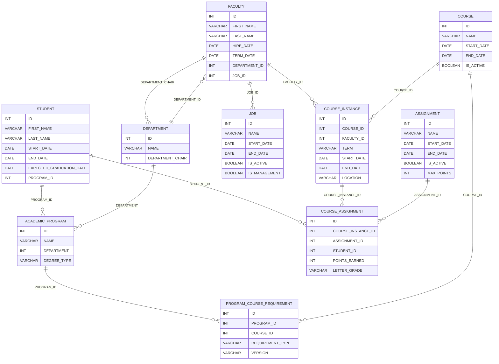

<!-- This diagram shows the ER model for the School Management System -->
<!-- Get the Markdown Preview Mermaid Support extension and diagram will render with Ctrl + Shift + V -->

```mermaid
erDiagram
    STUDENT {
        INT ID
        VARCHAR FIRST_NAME
        VARCHAR LAST_NAME
        DATE START_DATE
        DATE END_DATE
        DATE EXPECTED_GRADUATION_DATE
        INT PROGRAM_ID
    }

    FACULTY {
        INT ID
        VARCHAR FIRST_NAME
        VARCHAR LAST_NAME
        DATE HIRE_DATE
        DATE TERM_DATE
        INT DEPARTMENT_ID
        INT JOB_ID
    }

    DEPARTMENT {
        INT ID
        VARCHAR NAME
        INT DEPARTMENT_CHAIR
    }

    JOB {
        INT ID
        VARCHAR NAME
        DATE START_DATE
        DATE END_DATE
        BOOLEAN IS_ACTIVE
        BOOLEAN IS_MANAGEMENT
    }

    ACADEMIC_PROGRAM {
        INT ID
        VARCHAR NAME
        INT DEPARTMENT
        VARCHAR DEGREE_TYPE
    }

    COURSE {
        INT ID
        VARCHAR NAME
        DATE START_DATE
        DATE END_DATE
        BOOLEAN IS_ACTIVE
    }

    PROGRAM_COURSE_REQUIREMENT {
        INT ID
        INT PROGRAM_ID
        INT COURSE_ID
        VARCHAR REQUIREMENT_TYPE
        VARCHAR VERSION
    }

    ASSIGNMENT {
        INT ID
        VARCHAR NAME
        DATE START_DATE
        DATE END_DATE
        BOOLEAN IS_ACTIVE
        INT MAX_POINTS
    }

    COURSE_INSTANCE {
        INT ID
        INT COURSE_ID
        INT FACULTY_ID
        VARCHAR TERM
        DATE START_DATE
        DATE END_DATE
        VARCHAR LOCATION
    }

    COURSE_ASSIGNMENT {
        INT ID
        INT COURSE_INSTANCE_ID
        INT ASSIGNMENT_ID
        INT STUDENT_ID
        INT POINTS_EARNED
        VARCHAR LETTER_GRADE
    }

    STUDENT ||--o{ ACADEMIC_PROGRAM : "PROGRAM_ID"
    STUDENT ||--o{ COURSE_ASSIGNMENT : "STUDENT_ID"

    FACULTY ||--o{ DEPARTMENT : "DEPARTMENT_CHAIR"
    FACULTY ||--o{ COURSE_INSTANCE : "FACULTY_ID"
    FACULTY ||--o{ JOB : "JOB_ID"

    DEPARTMENT ||--o{ ACADEMIC_PROGRAM : "DEPARTMENT"
    DEPARTMENT ||--o{ FACULTY : "DEPARTMENT_ID"

    ACADEMIC_PROGRAM ||--o{ PROGRAM_COURSE_REQUIREMENT : "PROGRAM_ID"

    COURSE ||--o{ PROGRAM_COURSE_REQUIREMENT : "COURSE_ID"
    COURSE ||--o{ COURSE_INSTANCE : "COURSE_ID"

    COURSE_INSTANCE ||--o{ COURSE_ASSIGNMENT : "COURSE_INSTANCE_ID"

    ASSIGNMENT ||--o{ COURSE_ASSIGNMENT : "ASSIGNMENT_ID"
```