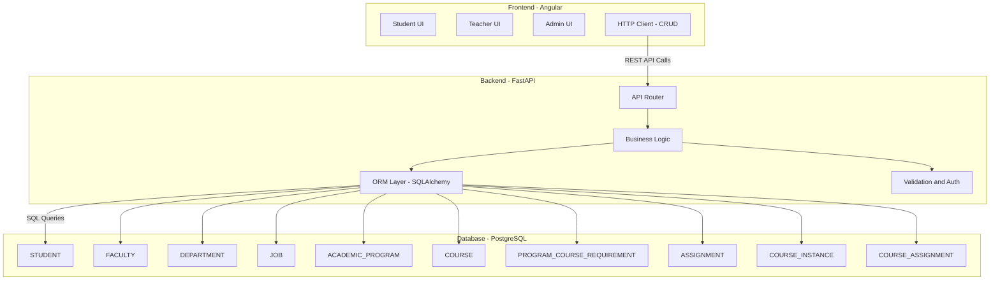

<!-- This diagram shows the system architecture intended for the project -->

```mermaid
graph TD
  subgraph Frontend - Angular
    A1[Student UI]
    A2[Teacher UI]
    A3[Admin UI]
    A4[HTTP Client - CRUD]
  end

  subgraph Backend - FastAPI
    B1[API Router]
    B2[Business Logic]
    B3[ORM Layer - SQLAlchemy]
    B4[Validation and Auth]
  end

  subgraph Database - PostgreSQL
    C1[STUDENT]
    C2[FACULTY]
    C3[DEPARTMENT]
    C4[JOB]
    C5[ACADEMIC_PROGRAM]
    C6[COURSE]
    C7[PROGRAM_COURSE_REQUIREMENT]
    C8[ASSIGNMENT]
    C9[COURSE_INSTANCE]
    C10[COURSE_ASSIGNMENT]
  end

  A4 -->|REST API Calls| B1
  B1 --> B2
  B2 --> B3
  B3 -->|SQL Queries| C1
  B3 --> C2
  B3 --> C3
  B3 --> C4
  B3 --> C5
  B3 --> C6
  B3 --> C7
  B3 --> C8
  B3 --> C9
  B3 --> C10
  B2 --> B4
```